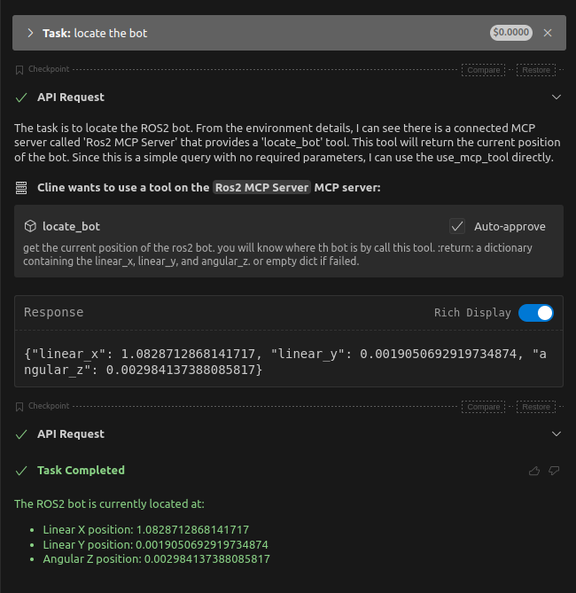
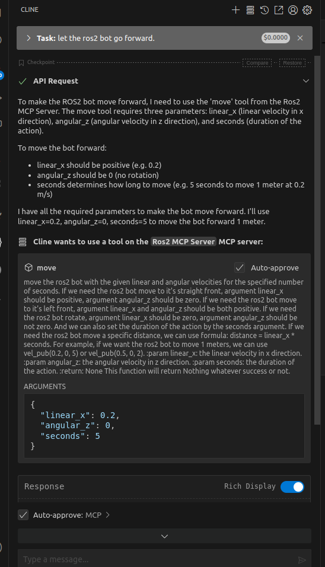
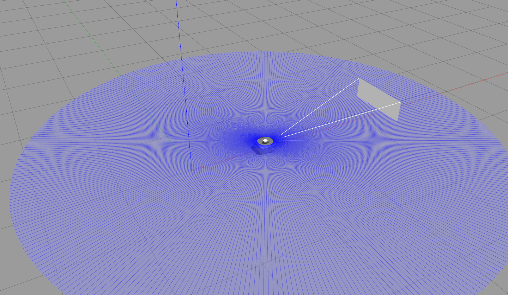

This project is used to let LLM control the ros2 robot by using MCP

like this:





After using the `move` tool, the robot will leave the original position (the coordinate orgin). like this:



I provide only 3 tools for now:

- locate: locate the tool in the robot's workspace
- move: move the tool to the desired position
- save_image: save the image captured by bot to specified directory

more details is in the comment of [mcp_server.py](./mcp_server.py)

I will add more tools in the future.

b.t.w, if U use cline, U should configure `mcp_cline_settings.json` like this:

```json
{
  "mcpServers": {
    "Ros2 MCP Server": {
      "command": "uv",
      "args": [
        "--directory",
        "/home/<your username>/mcp_ros2/mcp_ros2/",
        "run",
        "mcp_server.py"
      ],
      "env": {
        "SHELL": "<your shell path>",
        "PWD": "<your working directory path>",
        "LOGNAME": "<your username>",
        "HOME": "<your home directory path>",
        "USERNAME": "<your username>",
        "PYTHONPATH": "<your python path>",
        "PATH": "<your path value>",
        "TERM": "xterm-256color",
        "USER": "<your username>",
        "LD_LIBRARY_PATH": "<your ros library path>"
      },
    }
  }
}
```

the `env` value should be set according to your system.

the detailed usage I will upload on bilibili in the future.
